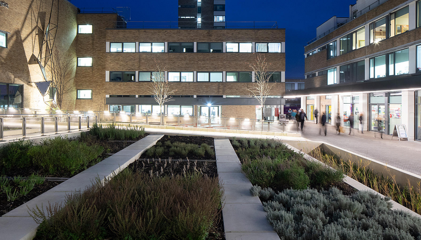

Urbanism is a topic people I follow have been talking about a lot lately. These people I follow who talk about urbanism are often either US or UK-based, and what they talk about primarily is the ideal of dense, walkable, sustainable communities that interweave comfort, utility, cultural and natural amenities. But urbanism is almost always, as the name suggests, about big cities.

I'm really into the idea of dense, walkable, sustainable communities, but I'm not really into big cities -- or at least, I love visiting them, but I think it's too late for me to ever acquire the taste for living in one. That's probably why I'm interested in the potential of the ideas from urbanism transplanted into villages and small towns. There's one example of a mid-twentieth century project that I feel perfectly captures the promise of 'village urbanism' -- a one-of-a-kind institution that's very close to my heart, and which I feel has never been given it's due: Lancaster University.

Lancaster's integrated campus , a couple of miles outside the city (which is really no bigger than a small town), was designed in the early 1960's, and built on the brow of a small hill. The story I've heard is that the architects came to the site one windy, wintery day, stood on top of the hill, and decided then and there that the campus would be inward-facing. The original campus was designed around sheltered cloisters packed tightly together, with a central pedestrian street -- the Spine -- running the length of the primary North-South axis, and cars relegated to the periphery. The effect they were aiming for was that of a medieval italian hill village.

Although you need more than a little imagination to look at the campus and see an italian hill village, the medieval village logic is clear enough. In fact I'm not sure why the architects needed to look so far afield, when Lancashire and Cumbria have more than their fair share of densely-packed old villages, where buildings huddle together with their backs to the weather. Some of those villages and small market towns, like Cartmel and Kirkby Lonsdale, would provide a fertile template for a complex multi-level, citadel-like urbanism. But there's no need to imagine what 'medieval village urbanism' could look like, because the architects of Lancaster University already created it, nearly sixty years ago.

Charles Carter, the University's first Vice-Chancellor, had a clear view of the kind of integrated walkable community he wanted:

> The Spine is to be continuously flanked from end to end with public rooms, lively and inviting places lit up at night, which the students will go there to mix. These rooms will be more like the lively high street of a small town than part of a secluded campus…the first aim is to prevent the emergence of a “nine to five” university.

It's not perfect, of course. 1960's construction methods often haven't stood the test of time, and the Lancaster campus has suffered its share of draughts, damp, and rotting window frames. But it's nothing a little renovation can't fix, and the campus has been extensively renovated in the past twenty years to fix many of these structural problems.

As I mentioned, the campus relegates cars to a perimeter road, but the location of the campus out of town, and further than walking distance from the train station, induces more car dependence than necessary. And you could argue that the campus has altogether too much provision for cars, whereas car use should be discouraged by limiting parking spaces. That's a popular view among urbanists, but personally I think that making the urbanist ideal more palatable for most people means not needlessly causing parking anxiety[^1].

The campus is not universally admired either. Of course, the average student doesn't think about the buildings themselves much at all. If they do have an opinion, it can often be boiled down to 'would prefer something older and quainter'. I even spoke to one student who called the campus a 'concrete jungle' -- but there's hardly any concrete used anywhere! It's as if the British psyche just imagines Hogwarts or Wren style academic architecture as the real deal, and considers anything less a disappointment.

The main material is actually yellowish bricks, chosen to chime with Lancaster's Georgian and Victorian yellowish sandstone townhouses, and they create a warm, human feel. Possibly partly because bricks are back in fashion as a construction material, the university is finally getting more attention for its architecture.

There's a sadness to my love of the campus, which is the fear that something so ambitious wouldn't be made today, and if it were, it certainly wouldn't be built near a small town in the North of England. It would probably be too big a risk for a private developer to attempt, and even if they wanted to, planning laws and pressure groups wouldn't allow it. For local and national decision-makers, such an investment might be seen as either 'picking winners' or 'regeneration', and neither of those are as popular as they were in the sixties.

I'd like to spread the word about Lancaster University campus as an early example of the kind of extremely integrated, citadel urbanism that could work in small towns and villages. For anyone planning anything similar, the campus's longevity and continuing success provide an existence proof, that could help win backing and investment. Unlike many ambitious projects of the sixties, the University campus hasn't fallen into disrepair or become a white elephant -- it's still going strong, welcoming more students and researchers from all over the world.

[^1]: That feeling you get when you need to make a journey and you don't know whether you'll be able to park.